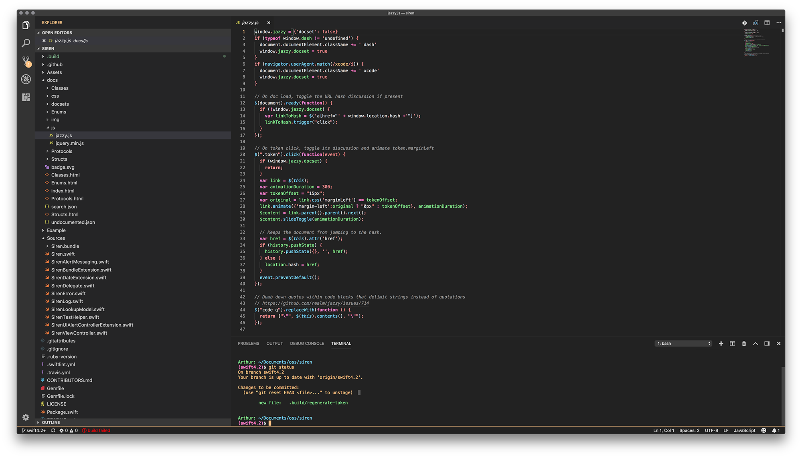

# Cognac 🥃 for VS Code
An Alluring, Dark, and Muted Syntax Theme For Visual Studio Code.

## About
Cognac is a theme composed of 11 colors that are easy on the eyes on both normal and light-reduced screens. All of the chosen colors are adjacent or complimentary to each other on the color wheel, excluding the black and gray colors.

Cognac is available for many other editors at http://github.com/ArtSabintsev/Cognac.

## Screenshot

## Palette

Color | Palette | Hex | Usage
--- | --- | --- | ---
 | Black      | #222222 | Background
 | Dark-Gray  | #555555 | Text Selection
 | Gray       | #999999 | Comments & Documentation
 | Light-Gray | #DFDFDF | Literals (Strings, Numbers) & Documentation Keywords
 | Pink       | #FF80C6 | Keywords
 | Purple     | #C18AFF | Classes & Types
 | Blue       | #87D5FF | Functions & Methods
 | Green      | #8AEC8A | Variables
 | Yellow     | #FFF680 | Macros & Attributes
 | Orange     | #FFC580 | Plain Text
 | Red        | #FF9595 | Constants

### Specific Rules
- Keywords, which are pink, should always be bolded.

## Installation Instructions
Search for `Cognac` in the extensions panel within VS Code.

## Credits
- [Arthur Ariel Sabintsev](http://www.sabintsev.com/)
